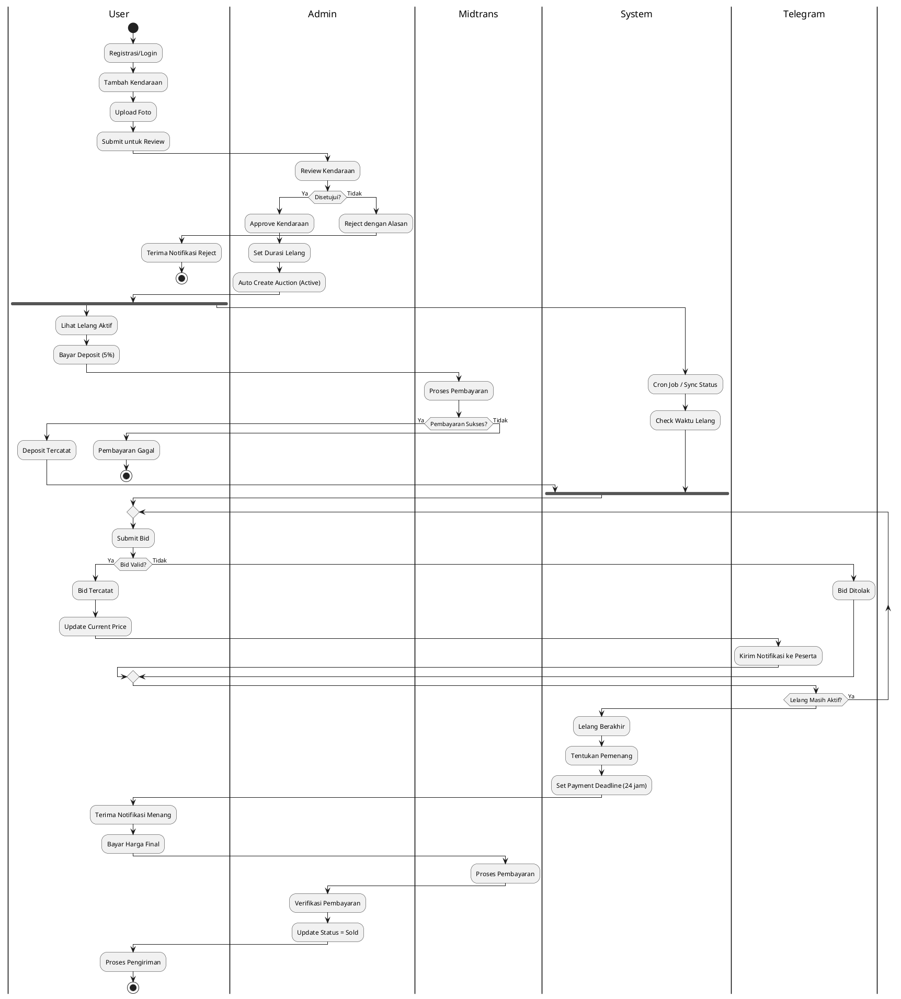
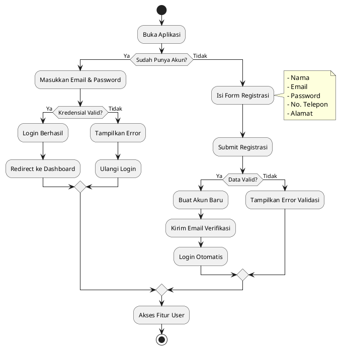
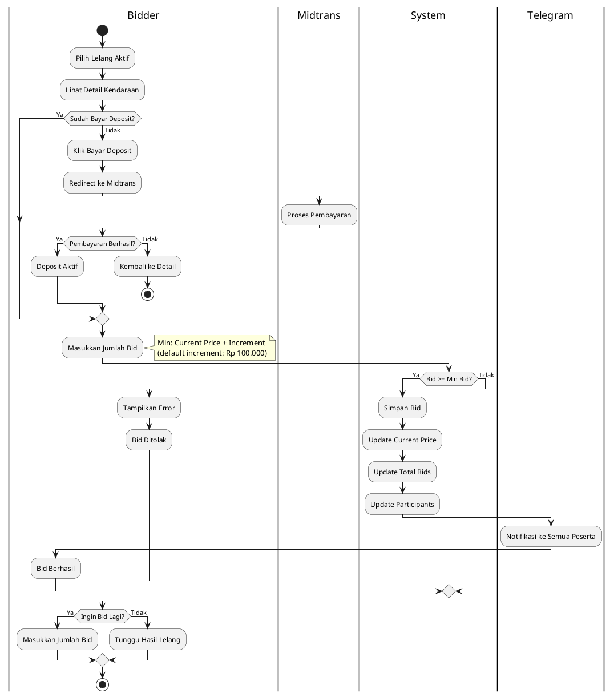
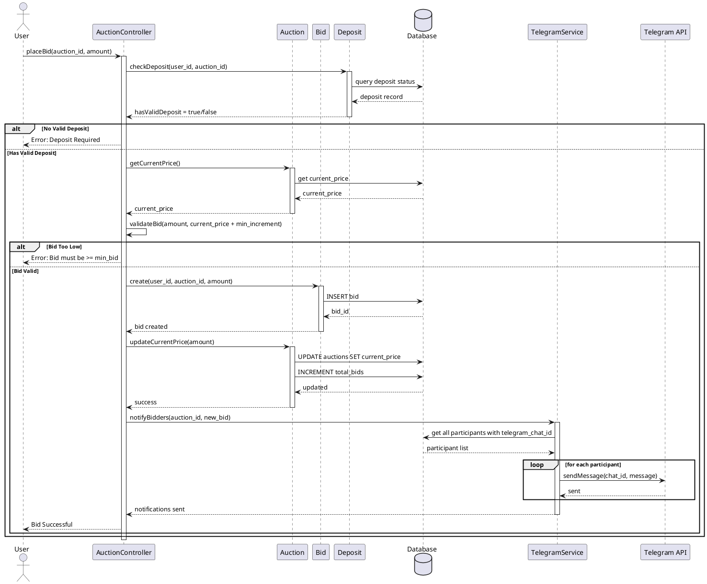
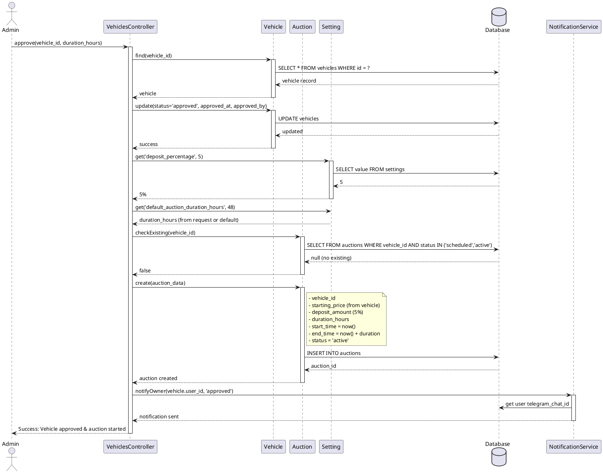
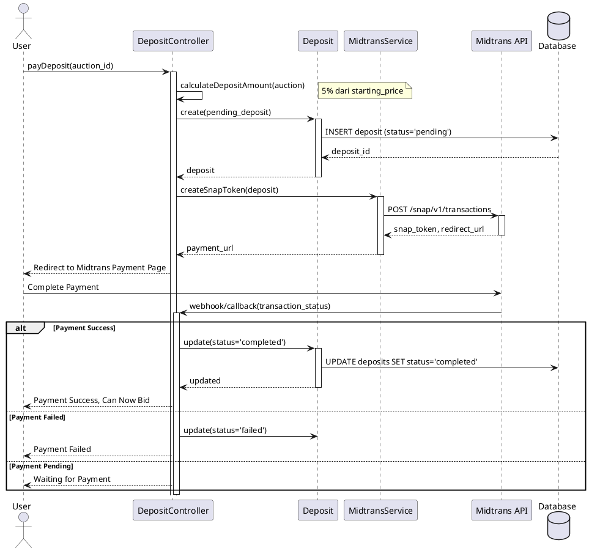
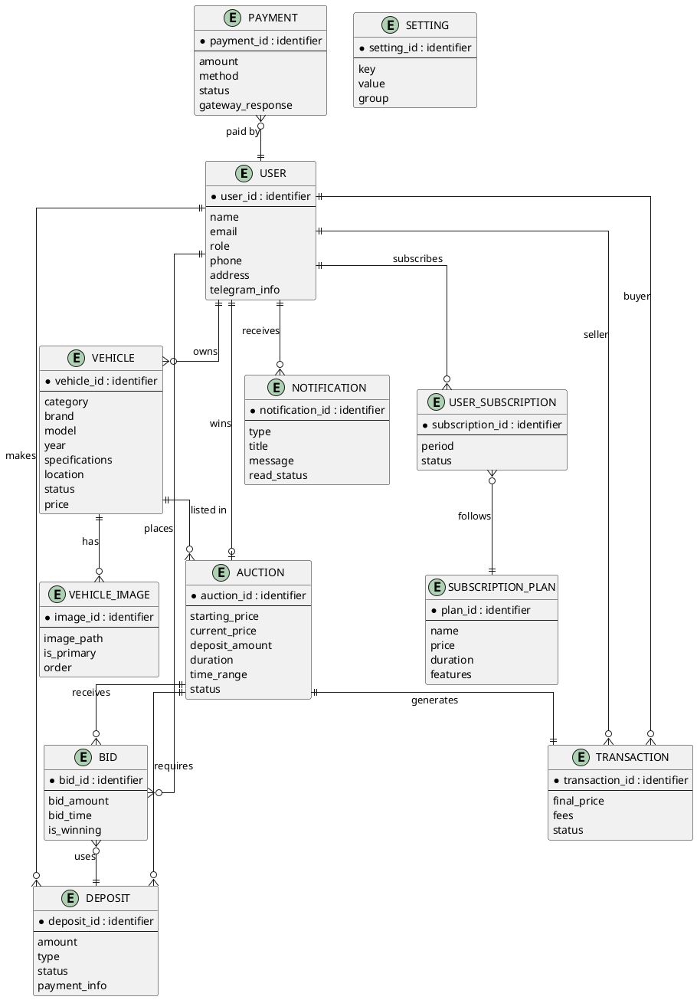
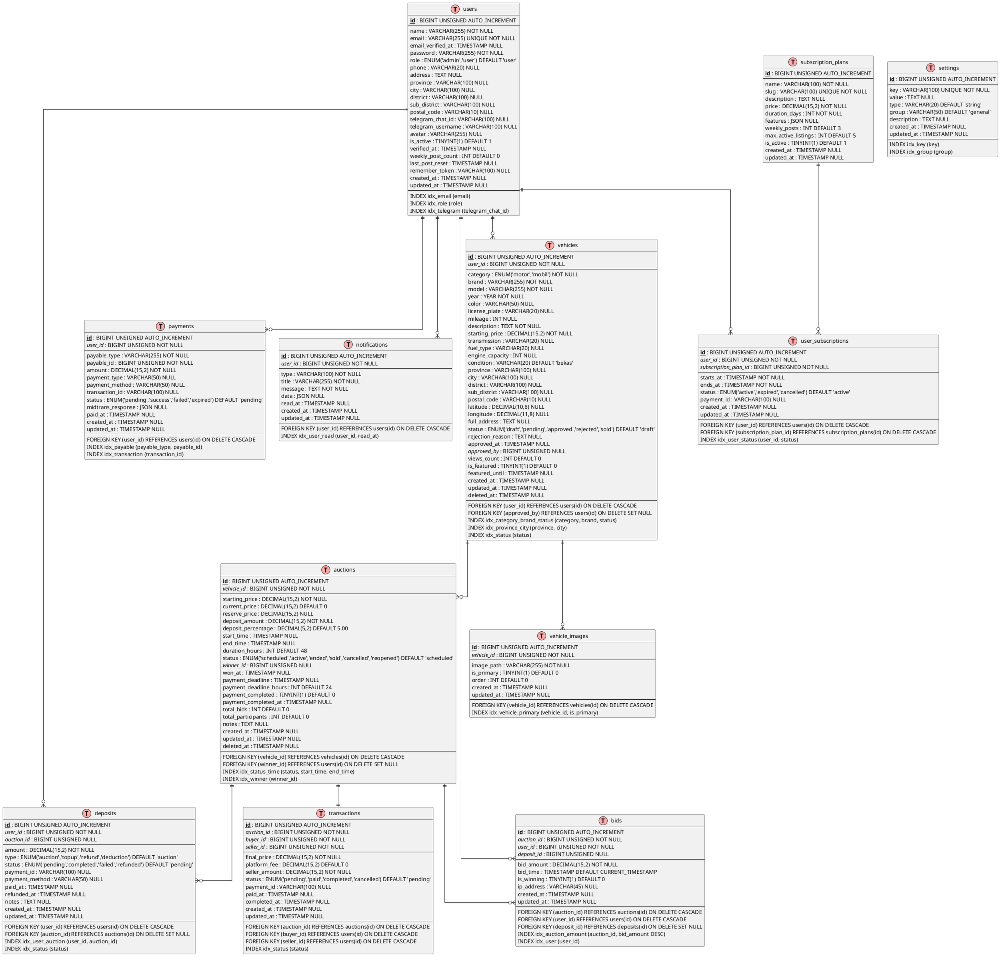

# 📊 Dokumentasi UML - Aplikasi Mokasindo
## Platform Lelang Kendaraan Online

---

## 1. Use Case Diagram

```plantuml
@startuml UseCase_Mokasindo

left to right direction
skinparam packageStyle rectangle
skinparam actorStyle awesome

' Actors
actor "Guest" as Guest
actor "User" as User
actor "Admin" as Admin
actor "Midtrans" as Midtrans <<system>>
actor "Telegram" as Telegram <<system>>

User -|> Guest

rectangle "Sistem Lelang Mokasindo" {
    ' Guest Use Cases
    usecase "Lihat Daftar Lelang" as UC1
    usecase "Lihat Detail Lelang" as UC2
    usecase "Cari Kendaraan" as UC3
    usecase "Registrasi Akun" as UC4
    usecase "Login" as UC5
    usecase "Lihat FAQ" as UC6
    usecase "Kirim Inquiry" as UC7
    
    ' User Use Cases
    usecase "Kelola Profil" as UC10
    usecase "Tambah Kendaraan" as UC11
    usecase "Upload Foto Kendaraan" as UC12
    usecase "Bayar Deposit" as UC13
    usecase "Ikut Lelang (Bid)" as UC14
    usecase "Lihat Riwayat Bid" as UC15
    usecase "Lihat Wishlist" as UC16
    usecase "Tambah ke Wishlist" as UC17
    usecase "Bayar Kemenangan" as UC18
    usecase "Lihat Notifikasi" as UC19
    usecase "Hubungkan Telegram" as UC20
    usecase "Lihat Kendaraan Saya" as UC21
    usecase "Berlangganan Premium" as UC22
    
    ' Admin Use Cases
    usecase "Kelola Users" as UC30
    usecase "Approve/Reject Kendaraan" as UC31
    usecase "Kelola Lelang" as UC32
    usecase "Sync Status Lelang" as UC33
    usecase "Force End Lelang" as UC34
    usecase "Lihat Laporan" as UC35
    usecase "Kelola Settings" as UC36
    usecase "Kelola FAQ" as UC37
    usecase "Kelola Halaman" as UC38
    usecase "Kelola Tim" as UC39
    usecase "Kelola Lowongan" as UC40
    usecase "Kelola Subscription Plans" as UC41
    usecase "Verifikasi Pembayaran" as UC42
    
    ' Relationships - Guest
    Guest --> UC1
    Guest --> UC2
    Guest --> UC3
    Guest --> UC4
    Guest --> UC5
    Guest --> UC6
    Guest --> UC7
    
    ' Relationships - User
    User --> UC10
    User --> UC11
    User --> UC12
    User --> UC13
    User --> UC14
    User --> UC15
    User --> UC16
    User --> UC17
    User --> UC18
    User --> UC19
    User --> UC20
    User --> UC21
    User --> UC22
    
    ' Relationships - Admin
    Admin --> UC30
    Admin --> UC31
    Admin --> UC32
    Admin --> UC33
    Admin --> UC34
    Admin --> UC35
    Admin --> UC36
    Admin --> UC37
    Admin --> UC38
    Admin --> UC39
    Admin --> UC40
    Admin --> UC41
    Admin --> UC42
    
    ' Include/Extend
    UC11 ..> UC12 : <<include>>
    UC14 ..> UC13 : <<include>>
    UC18 ..> UC13 : <<extend>>
    UC31 ..> UC32 : <<include>>
    
    ' System Integration
    UC13 --> Midtrans
    UC18 --> Midtrans
    UC19 --> Telegram
    Midtrans --> UC42
}

@enduml
```



### Deskripsi Use Case Utama

| No | Use Case | Aktor | Deskripsi |
|----|----------|-------|-----------|
| UC1 | Lihat Daftar Lelang | Guest/User | Melihat semua lelang aktif dan terjadwal |
| UC11 | Tambah Kendaraan | User | Mendaftarkan kendaraan untuk dilelang |
| UC13 | Bayar Deposit | User | Membayar deposit 5% untuk ikut lelang |
| UC14 | Ikut Lelang (Bid) | User | Melakukan penawaran pada lelang |
| UC31 | Approve Kendaraan | Admin | Menyetujui kendaraan → auto buat lelang |
| UC33 | Sync Status | Admin | Sinkronisasi status lelang (aktif/berakhir) |

---

## 2. Activity Diagram

### 2.1 Activity Diagram - Proses Lelang Lengkap



### 2.2 Activity Diagram - Registrasi & Login



### 2.3 Activity Diagram - Bidding



---

## 3. Sequence Diagram

### 3.1 Sequence Diagram - Proses Bidding



### 3.2 Sequence Diagram - Approve Kendaraan



### 3.3 Sequence Diagram - Pembayaran Deposit



---

## 4. Class Diagram

```plantuml
@startuml Class_Diagram

skinparam classAttributeIconSize 0

' ==================
' MODELS
' ==================

class User {
    +id: bigint
    +name: string
    +email: string
    +password: string
    +role: enum('admin','user')
    +phone: string
    +address: text
    +province: string
    +city: string
    +district: string
    +sub_district: string
    +postal_code: string
    +telegram_chat_id: string
    +telegram_username: string
    +avatar: string
    +is_active: boolean
    +verified_at: datetime
    +weekly_post_count: int
    +last_post_reset: datetime
    --
    +vehicles(): HasMany
    +bids(): HasMany
    +deposits(): HasMany
    +wonAuctions(): HasMany
    +subscriptions(): HasMany
    +notifications(): HasMany
}

class Vehicle {
    +id: bigint
    +user_id: bigint <<FK>>
    +category: enum('motor','mobil')
    +brand: string
    +model: string
    +year: year
    +color: string
    +license_plate: string
    +mileage: int
    +description: text
    +starting_price: decimal(15,2)
    +transmission: string
    +fuel_type: string
    +engine_capacity: int
    +condition: string
    +province: string
    +city: string
    +district: string
    +sub_district: string
    +postal_code: string
    +latitude: decimal
    +longitude: decimal
    +status: enum('draft','pending','approved','rejected','sold')
    +rejection_reason: text
    +approved_at: datetime
    +approved_by: bigint <<FK>>
    +views_count: int
    +is_featured: boolean
    --
    +user(): BelongsTo
    +images(): HasMany
    +primaryImage(): HasOne
    +auctions(): HasMany
    +approvedBy(): BelongsTo
    +scopeApproved()
    +scopePending()
    +scopeMotor()
    +scopeMobil()
}

class VehicleImage {
    +id: bigint
    +vehicle_id: bigint <<FK>>
    +image_path: string
    +is_primary: boolean
    +order: int
    --
    +vehicle(): BelongsTo
}

class Auction {
    +id: bigint
    +vehicle_id: bigint <<FK>>
    +starting_price: decimal(15,2)
    +current_price: decimal(15,2)
    +reserve_price: decimal(15,2)
    +deposit_amount: decimal(15,2)
    +deposit_percentage: decimal(5,2)
    +start_time: datetime
    +end_time: datetime
    +duration_hours: int
    +status: enum('scheduled','active','ended','sold','cancelled','reopened')
    +winner_id: bigint <<FK>>
    +won_at: datetime
    +payment_deadline: datetime
    +payment_deadline_hours: int
    +payment_completed: boolean
    +payment_completed_at: datetime
    +total_bids: int
    +total_participants: int
    +notes: text
    --
    +vehicle(): BelongsTo
    +bids(): HasMany
    +deposits(): HasMany
    +winner(): BelongsTo
    +transaction(): HasOne
    +isActive(): bool
    +hasEnded(): bool
    +isPaymentOverdue(): bool
    +updateCurrentPrice()
    +scopeActive()
    +scopeEnded()
    +scopeScheduled()
}

class Bid {
    +id: bigint
    +auction_id: bigint <<FK>>
    +user_id: bigint <<FK>>
    +deposit_id: bigint <<FK>>
    +bid_amount: decimal(15,2)
    +bid_time: datetime
    +is_winning: boolean
    +ip_address: string
    --
    +auction(): BelongsTo
    +user(): BelongsTo
    +deposit(): BelongsTo
}

class Deposit {
    +id: bigint
    +user_id: bigint <<FK>>
    +auction_id: bigint <<FK>>
    +amount: decimal(15,2)
    +type: enum('auction','topup','refund')
    +status: enum('pending','completed','failed','refunded')
    +payment_id: string
    +payment_method: string
    +paid_at: datetime
    +refunded_at: datetime
    +notes: text
    --
    +user(): BelongsTo
    +auction(): BelongsTo
    +bids(): HasMany
}

class Transaction {
    +id: bigint
    +auction_id: bigint <<FK>>
    +buyer_id: bigint <<FK>>
    +seller_id: bigint <<FK>>
    +final_price: decimal(15,2)
    +platform_fee: decimal(15,2)
    +seller_amount: decimal(15,2)
    +status: enum('pending','paid','completed','cancelled')
    +payment_id: string
    +paid_at: datetime
    +completed_at: datetime
    --
    +auction(): BelongsTo
    +buyer(): BelongsTo
    +seller(): BelongsTo
}

class Payment {
    +id: bigint
    +user_id: bigint <<FK>>
    +payable_type: string
    +payable_id: bigint
    +amount: decimal(15,2)
    +payment_type: string
    +payment_method: string
    +transaction_id: string
    +status: enum('pending','success','failed','expired')
    +midtrans_response: json
    +paid_at: datetime
    --
    +user(): BelongsTo
    +payable(): MorphTo
}

class Notification {
    +id: bigint
    +user_id: bigint <<FK>>
    +type: string
    +title: string
    +message: text
    +data: json
    +read_at: datetime
    --
    +user(): BelongsTo
    +markAsRead()
}

class Setting {
    +id: bigint
    +key: string
    +value: text
    +type: string
    +group: string
    +description: text
    --
    {static} +get(key, default)
    {static} +set(key, value)
}

class SubscriptionPlan {
    +id: bigint
    +name: string
    +slug: string
    +description: text
    +price: decimal(15,2)
    +duration_days: int
    +features: json
    +weekly_posts: int
    +max_active_listings: int
    +is_active: boolean
    --
    +subscriptions(): HasMany
}

class UserSubscription {
    +id: bigint
    +user_id: bigint <<FK>>
    +subscription_plan_id: bigint <<FK>>
    +starts_at: datetime
    +ends_at: datetime
    +status: enum('active','expired','cancelled')
    +payment_id: string
    --
    +user(): BelongsTo
    +plan(): BelongsTo
    +isActive(): bool
}

' ==================
' RELATIONSHIPS
' ==================

User "1" --> "*" Vehicle : owns
User "1" --> "*" Bid : places
User "1" --> "*" Deposit : makes
User "1" --> "*" Auction : wins
User "1" --> "*" Notification : receives
User "1" --> "*" UserSubscription : has

Vehicle "1" --> "*" VehicleImage : has
Vehicle "1" --> "*" Auction : listed in
Vehicle "*" --> "1" User : approved by

Auction "1" --> "*" Bid : receives
Auction "1" --> "*" Deposit : requires
Auction "1" --> "1" Transaction : generates
Auction "*" --> "1" Vehicle : for

Bid "*" --> "1" Deposit : uses

Transaction "*" --> "1" User : buyer
Transaction "*" --> "1" User : seller

UserSubscription "*" --> "1" SubscriptionPlan : subscribes

@enduml
```



---

## 5. Conceptual Data Model (CDM)



---

## 6. Physical Data Model (PDM)



---

## 📌 Catatan Penting

### Konvensi Database
- **Primary Key**: `id` (BIGINT UNSIGNED AUTO_INCREMENT)
- **Foreign Key**: `{table}_id` (BIGINT UNSIGNED)
- **Timestamps**: `created_at`, `updated_at` (TIMESTAMP)
- **Soft Delete**: `deleted_at` (TIMESTAMP NULL)
- **Money**: `DECIMAL(15,2)` untuk mata uang

### Status Enum
| Entity | Status Values |
|--------|---------------|
| Vehicle | draft, pending, approved, rejected, sold |
| Auction | scheduled, active, ended, sold, cancelled, reopened |
| Deposit | pending, completed, failed, refunded |
| Payment | pending, success, failed, expired |
| Transaction | pending, paid, completed, cancelled |
| Subscription | active, expired, cancelled |

### Index Strategy
- Composite index untuk query yang sering: `(status, start_time, end_time)`
- Index pada foreign keys
- Unique index pada email, slug

---

## 🔧 Cara Render Diagram

### Online Tools
1. **PlantUML Online**: https://www.plantuml.com/plantuml/
2. **PlantText**: https://www.planttext.com/
3. **Kroki**: https://kroki.io/

### VS Code Extension
1. Install "PlantUML" extension
2. Buka file `.puml` atau `.plantuml`
3. `Alt + D` untuk preview

### Command Line
```bash
# Install PlantUML
choco install plantuml

# Generate PNG
plantuml diagram.puml

# Generate SVG
plantuml -tsvg diagram.puml
```

---

**Dibuat**: 24 Desember 2025  
**Version**: 1.0.0
